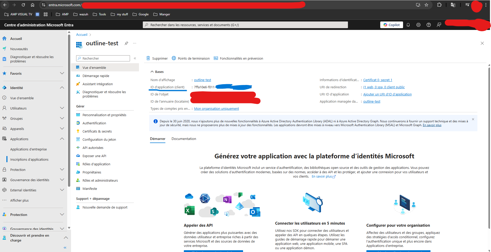
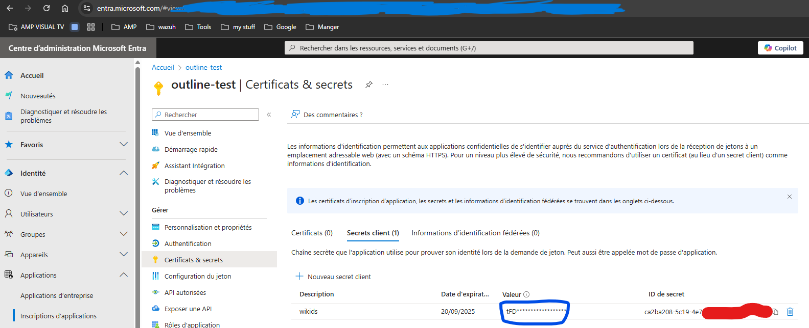
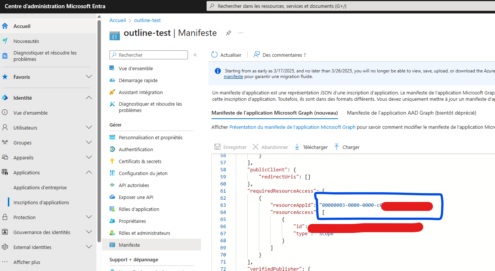
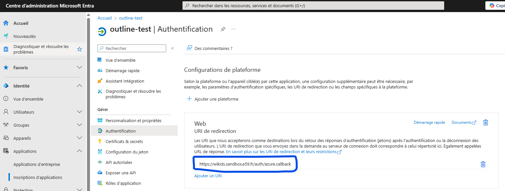

# Outline

# Outline **sur docker**

## Conteneur

```bash
# démarrer le conteneur
docker compose up -d

# statut des conteneur
docker ps

# stopper les conteneurs
docker compose down

# afficher les logs des conteneurs
docker logs <conteneur_name>
```

# Annexes pour NGINX e59

## docker.env en e59 

La doc de outline nous utilise https-portal, on en aura pas besoin ici car on a nginx.

Admettons que notre domaine soit https://wiki.sandbox.e59.fr

## Requirement

__<https://docs.getoutline.com/s/hosting/doc/requirements-ULdYnwi4wG>__

mise à jour + installation des prérequis : 

```bash
sudo apt update && sudo apt upgrade
sudo apt install docker-compose-v2
```

### Optionnel

Pour des tests ou débogage : 

```bash
sudo apt install curl net-tools
```

## Fichier d'environnement

<https://github.com/outline/outline/blob/main/.env.sample>

### Accessibilité et clés

Il faut premièrement générer des clés aléatoires secrètes avec `openssl rand -hex 32`, une de chaque pour les balises suivantes : 

```bash
SECRET_KEY=keyval1
UTILS_SECRET=keyval2
```

Puis mettre les valeurs 5 et 10 comme ceci. Ces deux variables définissent la taille du pool de connexions entre Outline et PostgreSQL via Sequelize (le client Node.js utilisé). C'est une réserve de connexions ouvertes à la base de données, maintenues prêtes à l'emploi. Cela évite de devoir ouvrir/fermer une connexion à chaque requête, ce qui serait très lent et coûteux. Si tu as 5 utilisateurs actifs, Outline pourra ouvrir jusqu'à 10 connexions vers PostgreSQL. Quand les utilisateurs sont inactifs, au moins 5 connexions resteront ouvertes et prêtes (défini par MIN=5), donc les prochaines requêtes seront rapides.

```bash
DATABASE_CONNECTION_POOL_MIN=5
DATABASE_CONNECTION_POOL_MAX=10
```

Désactiver la connection en SSL pour postgresql : `PGSSLMODE=disable`

Le champ URL correspond au nom de domaine de Outline :

`URL=https://wiki.sandbox.e59.fr`

`#PORT=3000`

### Authentification 

Nous allons utiliser Entra ID de Microsoft pour nous connecter, pour cela il faut remplir les champs suivants : 

Pour obtenir ces valeur il faut se rendre sur __<https://entra.microsoft.com>__ : 

 En bleu c'est le `AZURE_CLIENT_ID=`\n 

En bleu c'est le `AZURE_CLIENT_SECRET=`

 

En bleu c'est le AZURE_RESOURCE_APP_ID=\n 

Il ajouter au domaine /auth/azure.callback

### Envoie de mail

__<https://docs.getoutline.com/s/hosting/doc/smtp-cqCJyZGMIB>__

Il faut configurer ces balises : 

```bash
SMTP_HOST=
SMTP_PORT=
SMTP_USERNAME=
SMTP_PASSWORD=
SMTP_FROM_EMAIL=
SMTP_REPLY_EMAIL=
SMTP_TLS_CIPHERS=
SMTP_SECURE=true
```

## Fichier docker compose

__<https://docs.getoutline.com/s/hosting/doc/docker-7pfeLP5a8t>__

Comme nous utilisons nginx ont peut retirer la partie https-portal ainsi que son volume.

Changement pour Outline, il faut remplacer la balise expose avec ports comme ceci : 

ports:

\- "3000:3000"

On fait de même pour Redis : 

ports:

\- "6379:6379"

Et pour Postgresql : 

ports:

\- "5432:5432"

## NGINX

```bash
/etc/nginx/sites-available/sandbox.e59.fr
```

Configuration de la e59 en interne : 

```javascript
server {
    listen 80;
    server_name wikids.sandbox.e59.fr;

    location / {
        proxy_pass http://10.59.120.16:3000;

        proxy_http_version 1.1;
        proxy_set_header Upgrade $http_upgrade;
        proxy_set_header Connection "upgrade";
        proxy_buffering off;
        proxy_set_header Host $host;
        proxy_set_header X-Real-IP $remote_addr;
        proxy_set_header X-Forwarded-For $proxy_add_x_forwarded_for;
        proxy_set_header X-Forwarded-Proto https;
    }
}
```

En externe : 

```javascript
server {
    listen 443 ssl;
    server_name *.sandbox.e59.fr;

    ssl_certificate /etc/letsencrypt/live/sandbox.e59.fr/fullchain.pem;
    ssl_certificate_key /etc/letsencrypt/live/sandbox.e59.fr/privkey.pem;

    location / {
        # limit_req zone=one;
        proxy_pass http://127.0.0.1:80;
        
        proxy_set_header Host $host;
        proxy_set_header X-Real-IP $remote_addr;
        proxy_set_header X-Forwarded-For $remote_addr;
        proxy_set_header X-Forwarded-Proto $scheme;
        proxy_set_header X-Forwarded-Port 443;  # Ajoute ceci si n  cessaire
        proxy_http_version 1.1;
        proxy_set_header Upgrade $http_upgrade;
        proxy_set_header Connection "upgrade";
        proxy_buffering off;
    }
}
```